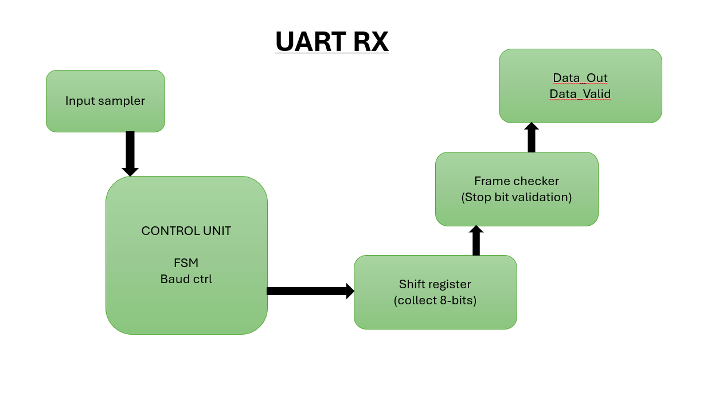
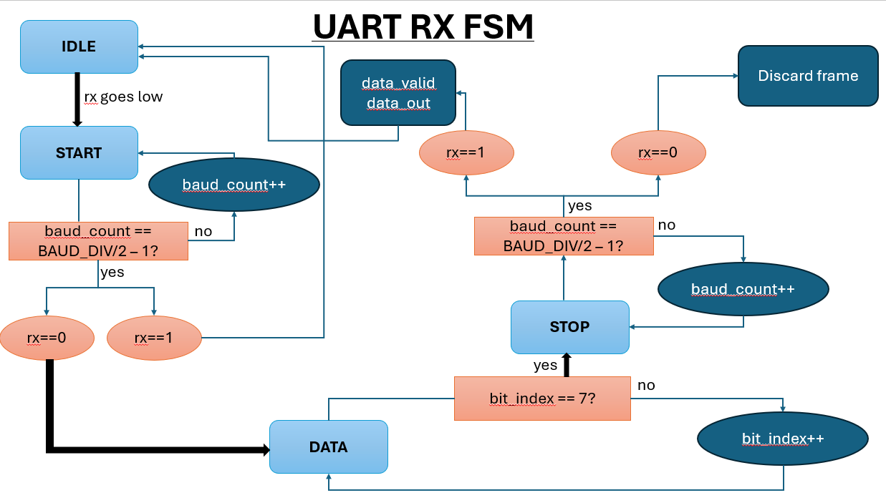
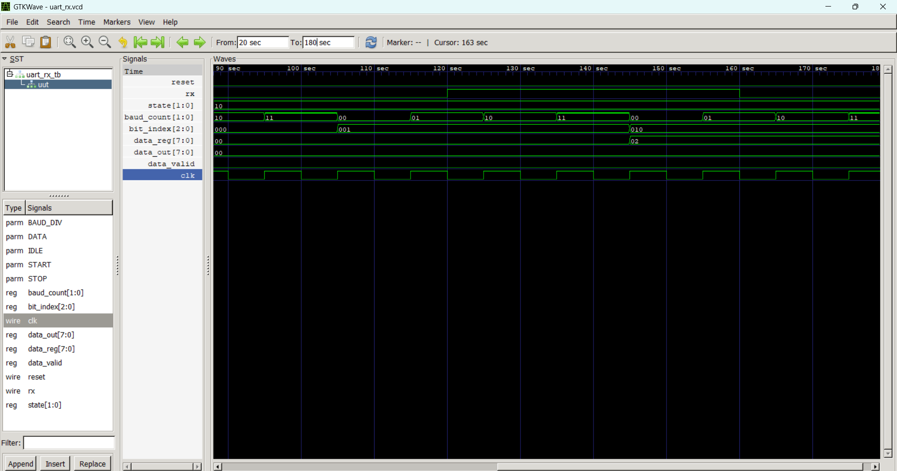

# UART Transmitter and Receiver in Verilog HDL

A UART (Universal Asynchronous Receiver/Transmitter) implementation in **Verilog HDL** featuring separate transmitter and receiver modules, finite state machine (FSM) based control, configurable baud-rate generation, and functional verification using **Icarus Verilog** and **GTKWave**.


## Table of Contents

- [Project Overview](#project-overview)
- [UART Frame Format](#uart-frame-format)
- [Repository Structure](#repository-structure)
- [UART Transmitter](#uart-transmitter)
- [UART Receiver](#uart-receiver)
- [Simulation](#simulation)
- [Results](#results)
- [Future Improvements](#future-improvements)

## Project Overview

UART (Universal Asynchronous Receiver/Transmitter) is an asynchronous serial communication interface that enables data transfer between digital devices using separate transmit (TX) and receive (RX) lines. A UART frame consists of a start bit, 8 data bits (transmitted LSB first), and a stop bit.

This project implements both a UART transmitter and receiver in Verilog HDL. The transmitter converts 8-bit parallel data into a serial bit stream, while the receiver reconstructs the original byte by sampling the incoming serial data. Both modules are designed using finite state machines (FSMs) and verified through simulation using Icarus Verilog and GTKWave.

## UART Frame Format

The implemented UART frame follows the standard 8-N-1 format:

```
| Start | D0 | D1 | D2 | D3 | D4 | D5 | D6 | D7 | Stop |
```

- **Start Bit:** Logic 0
- **Data Bits:** 8 bits (Least Significant Bit first)
- **Parity:** None
- **Stop Bit:** Logic 1

## Repository Structure

```text
UART-Verilog
│
├── rtl/
│   ├── uart_tx.v
│   └── uart_rx.v
│
├── tb/
│   ├── uart_tx_tb.v
│   └── uart_rx_tb.v
│
├── images/
│   ├── tx_architecture.png
│   ├── tx_fsm.png
│   ├── rx_architecture.png
│   └── rx_fsm.png
│
├── waveforms/
│   ├── uart_tx_waveform.png
│   └── uart_rx_waveform.png
│
└── README.md
```

## UART Transmitter

The UART transmitter converts an 8-bit parallel input into a serial data stream. The transmission follows the standard UART 8-N-1 frame format by sending one start bit, eight data bits (LSB first), and one stop bit. An FSM controls the transmission process while a baud counter ensures correct timing between successive bits.

### Architecture

<p align="center">
  

  ### Finite State Machine (FSM)

<p align="center">
  
</p>

### Operation

The transmitter operates using four states:

- **IDLE** – Waits for the `start` signal while keeping the TX line HIGH.
- **START** – Transmits the start bit (`0`) for one baud period.
- **DATA** – Sends eight data bits serially, beginning with the least significant bit (LSB).
- **STOP** – Transmits the stop bit (`1`) and returns to the IDLE state, ready for the next transmission.

- ### Simulation Waveform

<p align="center">
  
</p>

The waveform confirms successful transmission of the test byte (`0xAA`) using the UART 8-N-1 frame format. The FSM progresses through the IDLE, START, DATA, and STOP states while the baud counter controls the timing of each transmitted bit.
</p>

## UART Receiver

The UART receiver converts an incoming serial data stream into an 8-bit parallel output. It detects the start bit, samples each incoming bit at the configured baud interval, verifies the stop bit, and asserts a `data_valid` signal once a complete frame has been successfully received.

### Architecture

<p align="center">
  
</p>

### Finite State Machine (FSM)

<p align="center">
  
</p>

### Operation

The receiver operates using four states:

- **IDLE** – Waits for the RX line to transition LOW, indicating the start of a new frame.
- **START** – Confirms a valid start bit by sampling the RX line after half a baud period.
- **DATA** – Samples and stores eight incoming data bits (LSB first) into an internal shift register.
- **STOP** – Verifies the stop bit. If valid, the received byte is transferred to `data_out` and `data_valid` is asserted for one clock cycle before returning to the IDLE state.

- ### Simulation Waveform

<p align="center">
  
</p>

The waveform demonstrates successful reception of the transmitted byte **0xAA**. The receiver detects the start bit, samples each data bit at the correct baud interval, validates the stop bit, transfers the received byte to `data_out`, and briefly asserts `data_valid` to indicate a successful reception.

> **Note:** Complete simulation waveforms are available in the `waveforms/` directory.
>
> ## Simulation

The design was functionally verified using **Icarus Verilog** for compilation and simulation, and **GTKWave** for waveform visualization.

### UART Transmitter

```bash
iverilog -o uart_tx_sim rtl/uart_tx.v tb/uart_tx_tb.v
vvp uart_tx_sim
gtkwave uart_tx.vcd
```

### UART Receiver

```bash
iverilog -o uart_rx_sim rtl/uart_rx.v tb/uart_rx_tb.v
vvp uart_rx_sim
gtkwave uart_rx.vcd
```

## Results

The UART Transmitter and Receiver were successfully implemented and verified through simulation.

### Verified Functionality

- Successfully transmitted and received the byte **0xAA** using the UART **8-N-1** frame format.
- Correct generation and detection of Start and Stop bits.
- Accurate serial transmission of data bits (LSB first).
- Correct finite state machine (FSM) transitions for both transmitter and receiver.
- Successful reconstruction of the transmitted byte at the receiver.
- `data_valid` is asserted for one clock cycle after successful frame reception.
- Functional verification performed using **Icarus Verilog** and **GTKWave**.

- ## Future Improvements

Potential enhancements to this project include:

- Configurable baud-rate selection
- Support for parity generation and checking
- Configurable stop-bit selection
- 16× oversampling receiver for improved noise immunity
- FIFO buffering for continuous transmission and reception
- Loopback testing by connecting the transmitter directly to the receiver
- FPGA implementation and hardware validation

- ## Key Concepts Demonstrated

- Verilog HDL
- Finite State Machine (FSM) Design
- Sequential Logic
- Register Transfer Level (RTL) Design
- Serial Communication (UART)
- Baud Rate Generation
- Testbench Development
- Functional Verification
- Waveform Analysis using GTKWave
